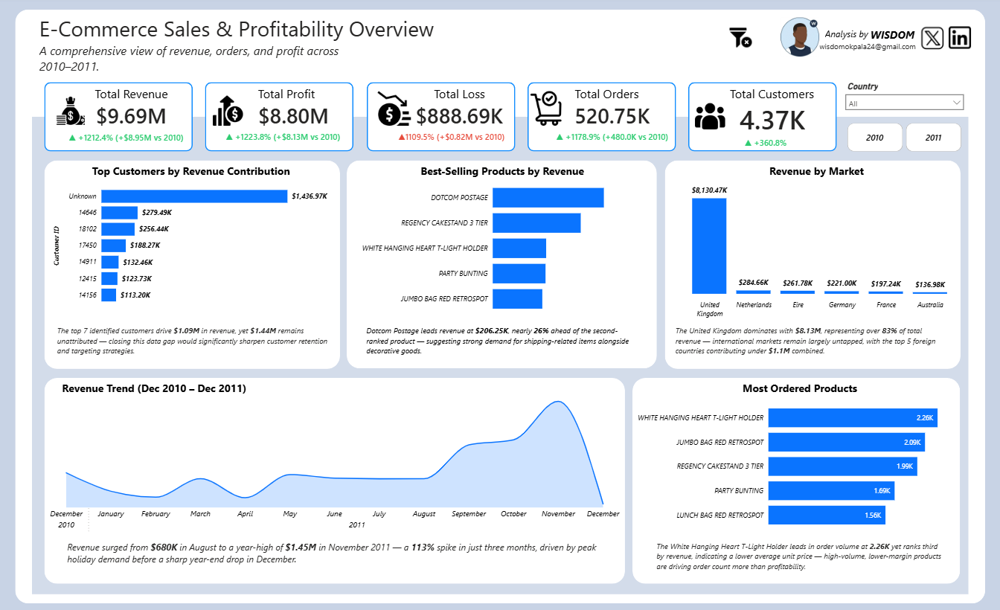

# 📊 E-Commerce Sales & Profitability Analysis | Power BI + SQL Server

> End-to-end business intelligence project — from raw data cleaning in SQL Server to an interactive executive dashboard in Power BI.

👉 **[View Live Interactive Dashboard](https://rebrand.ly/sdnww14)**

---

## 📌 Project Summary

This project demonstrates a complete data analytics workflow applied to a real-world e-commerce dataset spanning **December 2010 – December 2011**. The pipeline covers data extraction, cleaning, modelling, DAX measure development, and executive-level dashboard design.

The objective was to surface actionable business insights across revenue, profitability, customer behaviour, and product performance — presented in a format decision-makers can use immediately.

---


---

## 🛠️ Tools & Technologies

| Tool | Purpose |
|---|---|
| SQL Server (SSMS) | Data cleaning, transformation, and preparation |
| Power BI Desktop | Data modelling, DAX, and dashboard visualisation |
| DAX | KPI calculations, time intelligence, dynamic measures |

---

## 🗂️ Dataset

| Property | Detail |
|---|---|
| Source | Online Retail Dataset (UCI Machine Learning Repository) |
| Volume | 500,000+ rows of raw transactional records |
| Period | December 2010 – December 2011 |
| Grain | One row per invoice line item |
| Key Fields | Invoice No, Customer ID, Stock Code, Description, Quantity, Unit Price, Country, Invoice Date, Revenue |

---

## 🧹 Data Cleaning (SQL Server / SSMS)

All cleaning was performed in SSMS prior to import into Power BI to ensure the analytical layer worked with reliable, structured data.

**Steps taken:**
- Removed duplicate transactions that would have inflated order and revenue counts
- Handled null and missing values across `Customer ID`, `Description`, and `Unit Price`
- Filtered out negative quantities and zero unit prices resulting from returns and data entry errors
- Standardised `Invoice Date` from `DateTime` to `Date` to enable accurate time intelligence joins
- Engineered a clean `Revenue` column (`Quantity × Unit Price`) as the base for all financial KPIs
- Replaced blank `Customer ID` values with `"Unknown"` to preserve row counts without dropping data

---

## 📐 Data Model

- **Fact Table:** `Online Retail Cleaned` — transactional grain, one row per invoice line
- **Dimension Table:** `Date Table` — dedicated date table built in DAX, marked as date table in Power BI
- **Relationship:** One-to-Many from `Date Table[Date]` → `Online Retail Cleaned[Invoice Date]`
- **Filter Direction:** Single (Date Table filters fact table)
- **Measure Tables:** `KPIs`, `YoY`, `YoY Colors` — all measures organised into dedicated tables with display folders

---

## 📈 Key Business Insights

### Revenue & Profitability
- Total revenue of **$9.69M** was generated across both years, with profit reaching **$8.80M** — reflecting strong margin performance
- Revenue surged **113%** between August and November 2011, driven by peak holiday demand, followed by a sharp decline in December — highlighting critical seasonality that should inform inventory and marketing planning

### Market Concentration
- The **United Kingdom** accounts for over **83% ($8.13M)** of total revenue
- The remaining top 5 international markets — Netherlands, Eire, Germany, France, and Australia — contributed under **$1.1M combined**
- This level of concentration represents both a risk (over-reliance on one market) and a significant international growth opportunity

### Customer Intelligence
- **$1.44M in revenue is unattributed** to unknown customers, while the top 7 identified customers drove $1.09M
- Closing this data gap through better customer identification would directly improve retention and targeting capabilities

### Product Performance
- **Dotcom Postage** leads revenue at **$206.25K** — nearly 26% ahead of the second-ranked product
- **White Hanging Heart T-Light Holder** leads in order volume at **2.26K units** but ranks third in revenue — a high-volume, low-margin signal worth monitoring for margin dilution

---

## 🧮 DAX Calculations

### Core KPI Measures

```dax
Total Revenue = SUM('Online Retail Cleaned'[Revenue])
```

```dax
Total Profit = 
SUMX(
    'Online Retail Cleaned',
    'Online Retail Cleaned'[Quantity] * 'Online Retail Cleaned'[Unit Price]
)
```

```dax
Total Loss = 
CALCULATE(
    SUM('Online Retail Cleaned'[Revenue]),
    'Online Retail Cleaned'[Revenue] < 0
)
```

```dax
Total Orders = DISTINCTCOUNT('Online Retail Cleaned'[Invoice No])
```

```dax
Total Customers = DISTINCTCOUNT('Online Retail Cleaned'[Customer ID])
```

---

### Prior Year (PY) Measures

```dax
Total Revenue PY = 
CALCULATE([Total Revenue], SAMEPERIODLASTYEAR('Date Table'[Date]))
```

```dax
Total Profit PY = 
CALCULATE([Total Profit], SAMEPERIODLASTYEAR('Date Table'[Date]))
```

```dax
Total Loss PY = 
CALCULATE([Total Loss], SAMEPERIODLASTYEAR('Date Table'[Date]))
```

```dax
Total Orders PY = 
CALCULATE([Total Orders], SAMEPERIODLASTYEAR('Date Table'[Date]))
```

```dax
Total Customers PY = 
CALCULATE([Total Customers], SAMEPERIODLASTYEAR('Date Table'[Date]))
```

---

### Year-over-Year % Measures

```dax
Total Revenue YoY % = 
DIVIDE([Total Revenue] - [Total Revenue PY], [Total Revenue PY], 0)
```

```dax
Total Profit YoY % = 
DIVIDE([Total Profit] - [Total Profit PY], [Total Profit PY], 0)
```

```dax
Total Loss YoY % = 
DIVIDE([Total Loss] - [Total Loss PY], [Total Loss PY], 0)
```

```dax
Total Orders YoY % = 
DIVIDE([Total Orders] - [Total Orders PY], [Total Orders PY], 0)
```

```dax
Total Customers YoY % = 
DIVIDE([Total Customers] - [Total Customers PY], [Total Customers PY], 0)
```

---

### YoY Text Measures

Dynamic text labels combining directional arrows with formatted percentage change — displayed as card subtitles across the dashboard.

```dax
Total Revenue YoY Text = 
VAR YoYPct = [Total Revenue YoY %]
VAR Arrow = IF(YoYPct >= 0, "▲ ", "▼ ")
RETURN
    IF(
        ISBLANK([Total Revenue PY]),
        "No prior year data",
        Arrow & FORMAT(ABS(YoYPct), "0.0%") & " YoY")
```

```dax
Total Profit YoY Text = 
VAR YoYPct = [Total Profit YoY %]
VAR Arrow = IF(YoYPct >= 0, "▲ ", "▼ ")
RETURN
    IF(
        ISBLANK([Total Profit PY]),
        "No prior year data",
        Arrow & FORMAT(ABS(YoYPct), "0.0%") & " YoY")
```

```dax
-- Note: Arrow logic is inverted for Loss — a decrease is positive
Total Loss YoY Text = 
VAR YoYPct = [Total Loss YoY %]
VAR Arrow = IF(YoYPct <= 0, "▲ ", "▼ ")
RETURN
    IF(
        ISBLANK([Total Loss PY]),
        "No prior year data",
        Arrow & FORMAT(ABS(YoYPct), "0.0%") & " YoY")
```

```dax
Total Orders YoY Text = 
VAR YoYPct = [Total Orders YoY %]
VAR Arrow = IF(YoYPct >= 0, "▲ ", "▼ ")
RETURN
    IF(
        ISBLANK([Total Orders PY]),
        "No prior year data",
        Arrow & FORMAT(ABS(YoYPct), "0.0%") & " YoY")
```

```dax
Total Customers YoY Text = 
VAR YoYPct = [Total Customers YoY %]
VAR Arrow = IF(YoYPct >= 0, "▲ ", "▼ ")
RETURN
    IF(
        ISBLANK([Total Customers PY]),
        "No prior year data",
        Arrow & FORMAT(ABS(YoYPct), "0.0%") & " YoY")
```

---

## 📊 Dashboard Features

- 5 KPI cards with dynamic YoY subtitles and conditional color formatting (▲ green / ▼ red)
- Cross-year revenue trend line chart (2010 vs 2011 on the same axis)
- Top customers by revenue contribution
- Best-selling products by revenue
- Most ordered products by volume
- Revenue by market (country breakdown)
- Country slicer and year filter buttons for interactive exploration

---

## 💡 What This Project Demonstrates

- End-to-end analytics ownership from raw data to executive dashboard
- Proficiency in SQL Server for data preparation at scale (500K+ rows)
- Advanced DAX including time intelligence, conditional logic, and dynamic text measures
- Data modelling best practices — dedicated date tables, clean relationships, organised measure tables
- Business storytelling — translating numbers into decisions executives can act on

---

## 📁 Repository Structure
├── README.md
├── dashboard-preview.png        # Dashboard screenshot
└── ECommerce_Dashboard.pbix     # Power BI report file

---

---

---

## 👤 Author

**Wisdom Okpala**  
Data Analyst | Power BI | SQL | DAX

[](https://www.linkedin.com/in/chidera-okpala-22417730a/)
[](https://x.com/PrimeW1sdom)
